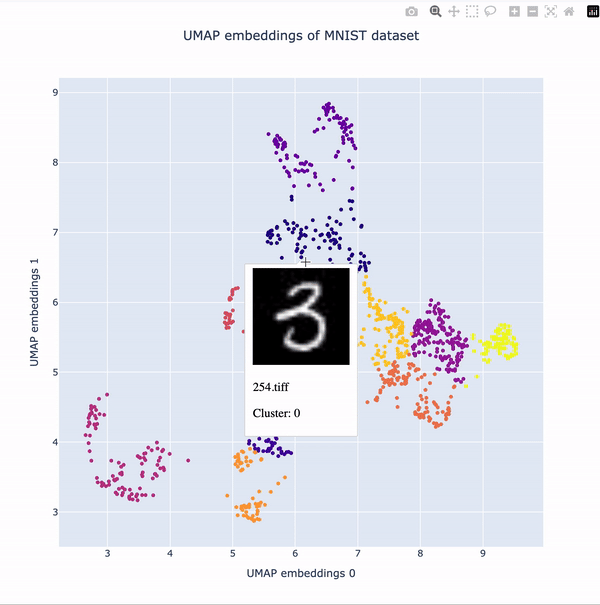

# Embedly
This is a set of Python scripts to help one visualize low-dimensional embeddings of images. 

## Features

- Visualizes embeddings using UMAP and t-SNE
- Convert images to thumbnails if they are too large
- Convert thumbnails to base64 to add to a pandas 
- (to add) Extract embeddings using Resnet or other networks

## Demo

## Work in progress...

